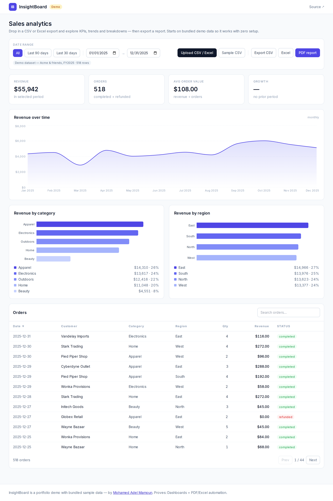
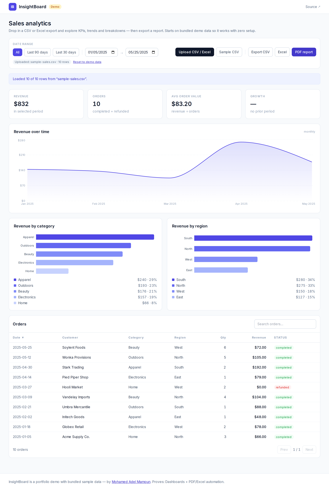

# InsightBoard — Business Analytics Dashboard

> Drop in a **CSV or Excel** sales export and instantly get **KPI cards, a revenue time‑series, category/region breakdowns and a filterable table** — then **export a polished PDF / Excel / CSV report**. The demo runs **100% in the browser with zero config**; a **FastAPI + SQLite** backend is included for the full, persistent version.

[](https://nextjs.org)
[](https://www.typescriptlang.org)
[](https://fastapi.tiangolo.com)
[](./LICENSE)

InsightBoard proves the **Dashboards + PDF/Excel automation** service area: a real analytics tool a small business could point at its own sales export. All bundled data is obviously fictional sample data (Acme, Globex, Initech…).

---

## Screenshots



| Upload your own CSV/Excel | Exports |
| --- | --- |
|  | PDF report · Excel (`.xlsx`) · CSV — all generated client‑side |

---

## Features

- **Ingest CSV _or_ Excel** — drop in a file and the dashboard re‑renders from it. Flexible header matching (`qty`/`quantity`, `price`/`unit_price`, `amount`/`revenue`, …) so real‑world exports just work; unparseable rows are skipped with a clear notice.
- **KPI cards** — Revenue, Orders, Avg order value, and **Growth vs the previous equal‑length period**.
- **Revenue time‑series** — monthly area chart (Recharts).
- **Breakdowns** — revenue by **category** and by **region**, with share %.
- **Filterable / sortable / paginated table** — search, sort any column, page through orders.
- **Date‑range filter** — quick presets (All / Last 90 / Last 30 days) + custom from/to; everything recomputes.
- **One‑click export** — **PDF** report (KPIs + breakdowns + top orders via jsPDF), **Excel** (`.xlsx`) and **CSV**, all generated in the browser.
- **Zero‑config demo** — bundled seed dataset; **no backend or keys needed** to run the live demo.
- **Optional backend** — FastAPI + SQLite for live ingest + persistence and server‑side exports.

## Tech stack

**Frontend (the live demo):** Next.js 15 (static export) · TypeScript · Tailwind CSS · Recharts · SheetJS (`xlsx`) for parse/export · jsPDF + autotable for PDF.

**Backend (full version):** FastAPI · SQLite (stdlib `sqlite3`) · pandas + openpyxl for aggregation and Excel export · Dockerfile.

```
insightboard/
├── frontend/   # static Next.js dashboard (zero-config demo)
└── backend/    # FastAPI + SQLite API (full version)
```

## Quick start

### Frontend (zero‑config demo)

```bash
cd frontend
npm install
npm run dev          # http://localhost:3000
# or build the static site:
npm run build        # → frontend/out  (host anywhere)
```

### Backend (full version — optional)

```bash
cd backend
python -m venv .venv && source .venv/bin/activate
pip install -r requirements.txt
uvicorn app.main:app --reload        # http://localhost:8000  (docs at /docs)
```

The database **auto‑seeds** with demo data on first run. Key endpoints:

| Method | Path | Purpose |
| --- | --- | --- |
| `GET` | `/api/health` | status + row count |
| `GET` | `/api/summary?from=&to=` | KPIs + series + breakdowns |
| `GET` | `/api/orders?from=&to=&limit=&offset=` | order rows |
| `POST` | `/api/upload` | ingest a CSV/Excel file |
| `POST` | `/api/reset` | re‑seed demo data |
| `GET` | `/api/export/{csv,xlsx}?from=&to=` | download report |

To point the frontend at the backend, set `NEXT_PUBLIC_API_URL=http://localhost:8000` in `frontend/.env.local`.

## Configuration

**Frontend** (`frontend/.env.example`) — all optional; the demo needs nothing:

| Variable | Purpose |
| --- | --- |
| `NEXT_PUBLIC_API_URL` | Point at the backend for the full version (blank = bundled demo data) |
| `NEXT_PUBLIC_BASE_PATH` | Base path for subdirectory hosting (e.g. GitHub Pages project sites) |

**Backend** (`backend/.env.example`): `DATABASE_PATH`, `CORS_ORIGINS`, `PORT`.

## Demo Mode

**The default _is_ demo mode — zero config, no keys.** The frontend ships a bundled, deterministic sample dataset (`frontend/data/seed.ts`) and does all parsing, charting and export **in the browser**. You can:

- explore the seeded data immediately,
- **upload your own** CSV/Excel (try `backend/sample_data/sample-sales.csv`) to see it re‑render, then **Reset to demo data**,
- export PDF/Excel/CSV — all client‑side, nothing leaves the page.

No backend is required for the live demo, so it’s safe to host publicly forever.

## Deploy

**Frontend (static)** — `cd frontend && npm run build`, then host `frontend/out` on **Cloudflare Pages / Netlify / Vercel** (free tier, zero maintenance). For a GitHub Pages project page, set `NEXT_PUBLIC_BASE_PATH=/insightboard` first.

**Backend (container)** — a `Dockerfile` is included:

```bash
cd backend
docker build -t insightboard-api .
docker run -p 8000:8000 insightboard-api
```

Deploy that image to any free‑tier container host (**Fly.io**, **Render**, **Railway**, Google Cloud Run). SQLite keeps it dependency‑light; mount a volume if you want persistence across restarts.

## Author

Built by **Mohamed Adel Mamoun** — full‑stack developer.
🌐 [mohamedadelmamoun.com](https://mohamedadelmamoun.com)

One of a series of open‑source portfolio projects, each proving a service area. InsightBoard proves **Dashboards + PDF/Excel automation**.

## License

[MIT](./LICENSE)
